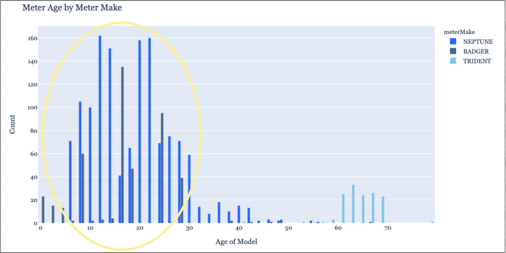
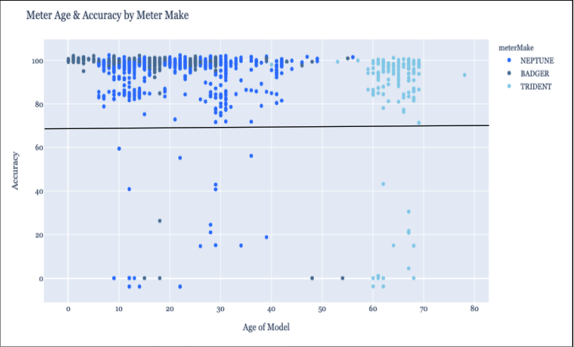

# Waterpump Quality Analysis 

  

 

# Project Overview
This project analyzes a sample set of water pump preformance. Data analysis demonstrates clear actionable areas to increase revenue and a model slide deck prepared for a hypothetical first meeting with clients reviews the current state of water pump preformance, revenue flow and details an action plan for partnership. This project also includes a piece overviewing the importance of data in the water industry. 

# Business Problem
A water company has asked for consultation and imput on how to best maintain, maximize lifetime value and develop predicitve capabilities for their current infastructure. This analysis and slide deck were done under the assumption that this is the first meeting between teams. 

# Data  
Data is a sampling of waterpumps included in the primary dataset is information on each meter's test year, installation year, size, make and most recent accuracy reading.

# Methods  
Descriptive statistics, data filtering, data visualization, revenue modeling. 

# Results  

## Current State of Meters  
* More than 2/3 of the total 1,960 units analyzed were 'Neptune' model pumps  
* 90% of the units were 5/8" in size 
* Age distribution of models shoed the majority of models were less than 30 years old  

  

## Revenue Review  
* $5.09 Current cost per CCF to customer  
* 53,988,433 Total recorded water use (CCF) in 2019  
* $367,355.64 Total earnings based on recorded water usage
* 1,700 (86%) of all units analyzed had reported Accuracy scores at or above 95%. The long left tail of data represents a small number of meters but an outsized effect on overall accuracy. 
* 4.3% Overall average gallons lost due to meter inaccuracy = 2,321,502 unrecorced gallons of water yearly = $15,796.29 potential missed earnings in 2019

## Action Plan (Recommendations)  
1. Replace lowest preforming meteres immediately  
* 96% Mean meter accuracy 
* 45 Meters < 70% accurate representing 2.3% of overall inventory 
* $6,750 cost to replace low preforming units 
2. Inspect meters with potential recording errors  
* Algorithm automatically flags meters with scores < 0 > 100% accuracy  
* Target inspection efforts to only flagged meters to reduce labor costs 
* Improve data insights with continual data delivery
3. Build predicitive models to plan for future meter replacement expenses 
* Using current data and machine learning, build a predictive and adaptive model to identify when meter replacement 
allowing for bettervbudgetary planning, more discretion on thresholds of performance, and greater insights into the future state of this 
key infrastructure

  

